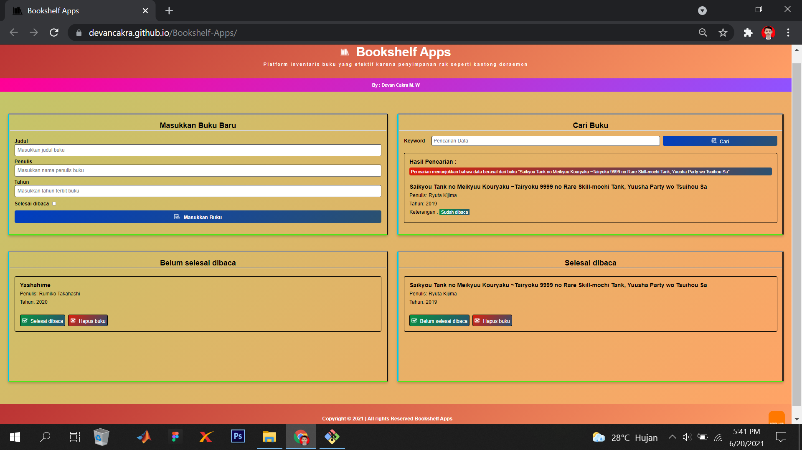

[](https://github.com/ellerbrock/open-source-badges/)
[](https://opensource.org/licenses/MIT)


# Bookshelf-Apps
<strong>Dicoding Assignment Submission</strong><br>
Learn Front End Web Development for Beginners.

<br><br>

## Project Requirements
| Part | Description |
| --- | --- |
| Code | HTML, CSS, & JS |
| Tools | Visual Studio Code, XAMPP (PHP Version 5+)  |

<br><br>

## Download & Install
1. XAMPP with PHP version 7.4

   <table><tr><td width="810">
   
   ```
   https://bit.ly/XAMPP_PHP7_Installer
   ```

   </td></tr></table><br>
   
2. Visual Studio Code

   <table><tr><td width="810">
   
   ```
   https://bit.ly/VScode_Installer
   ```

   </td></tr></table>

<br><br>

## Get Started
1. Download this repository.<br><br>
2. Extract the downloaded file.<br><br>
3. Move the ``` Bookshelf-Apps ``` directory into the ``` htdocs ``` directory, whose details you can find out as follows: ``` C:\xampp\htdocs ```.<br><br>
4. To access the website, open ``` XAMPP ```, then start the ``` Apache ``` section.<br><br>
5. Please open your ``` browser ``` by writing: ``` localhost/Bookshelf-Apps/ ```.<br><br>
6. Check the Local Storage section:<br><br>
   • ``` Right-click ``` on the website area and select -> ``` inspection ```.<br><br>
   • Check: ``` Application ``` -> ``` Local Storage ``` -> ``` Create a Local Storage ```.<br><br>
   &emsp;a. The key you need to create: ``` BOOKS_DATA ```.<br><br>
   &emsp;b. The value you need to create: ``` [] ```.<br><br>
   • Make sure it looks like the following image:<br><br><br><br>
7. Enjoy [Done].
   
<br><br>

## Highlights
<table>
<tr>
<th width="840">Bookshelf-Apps by Devan</th>
</tr>
<tr>
<td></td>
</tr>
</table>

<br><br>

## Appreciation
If this work is useful to you, then support this work as a form of appreciation to the author by clicking the ``` ⭐Star ``` button at the top of the repository.

<br><br>

## LICENSE
MIT License - Copyright © 2020 - Devan C. M. Wijaya

Permission is hereby granted without charge to any person obtaining a copy of this software and the software-related documentation files to deal in them without restriction, including without limitation the right to use, copy, modify, merge, publish, distribute, sublicense, and/or sell copies of the Software, and to permit persons receiving the Software to be furnished therewith on the following terms:

The above copyright notice and this permission notice must accompany all copies or substantial portions of the Software.

IN ANY EVENT, THE AUTHOR OR COPYRIGHT HOLDER HEREIN RETAINS FULL OWNERSHIP RIGHTS. THE SOFTWARE IS PROVIDED AS IS, WITHOUT WARRANTY OF ANY KIND, EITHER EXPRESS OR IMPLIED, THEREFORE IF ANY DAMAGE, LOSS, OR OTHERWISE ARISES FROM THE USE OR OTHER DEALINGS IN THE SOFTWARE, THE AUTHOR OR COPYRIGHT HOLDER SHALL NOT BE LIABLE, AS THE USE OF THE SOFTWARE IS NOT COMPELLED AT ALL, SO THE RISK IS YOUR OWN.
